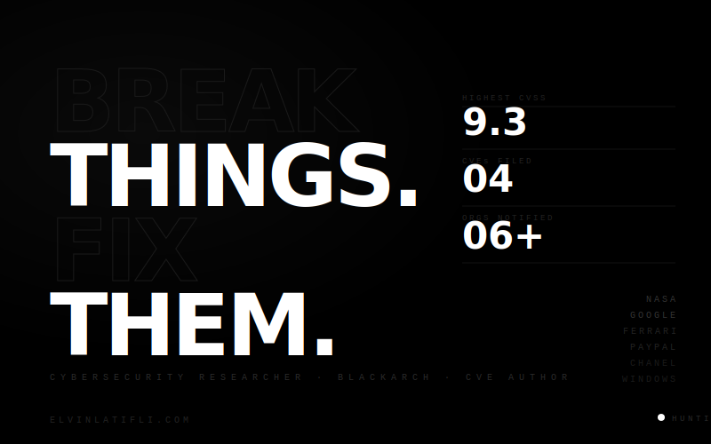

  

 

<table>
<tr>
<td width="50%" valign="top">

`rickshell` — [github.com/rickidevs/rickshell](https://github.com/rickidevs/rickshell)
> Post-exploitation tool & reverse shell handler · **BlackArch Official**

`rickphis` — [github.com/rickidevs/rickphis](https://github.com/rickidevs/rickphis)
> Phishing & social engineering toolkit · **Red Team**

</td>
<td width="50%" valign="top">

</td>
</tr>
</table>

 

 

